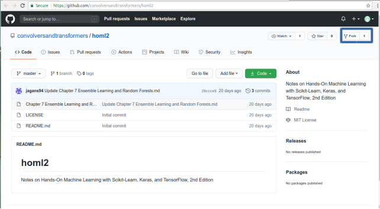
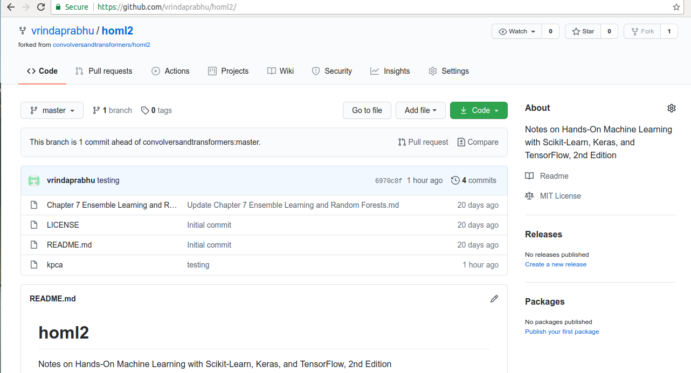
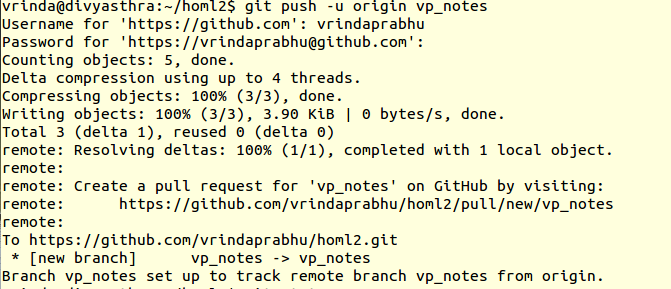
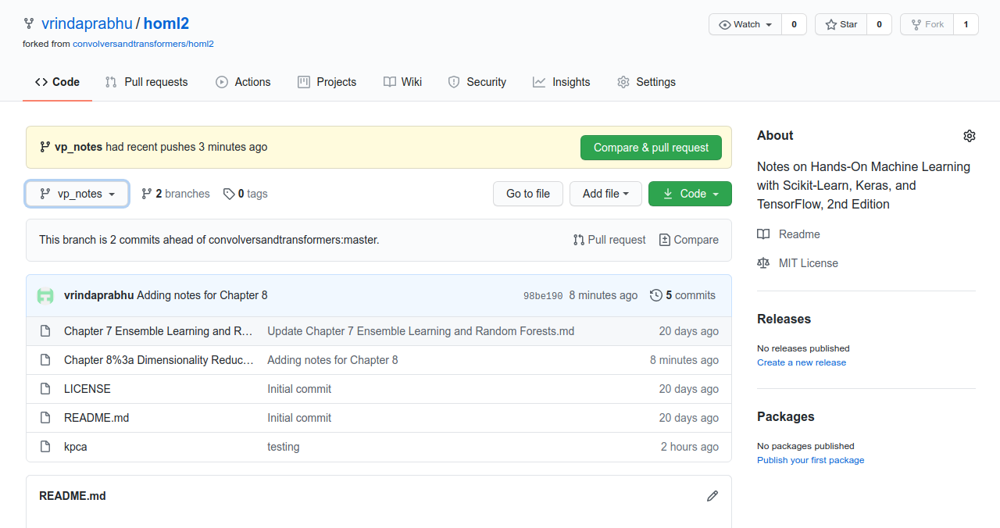
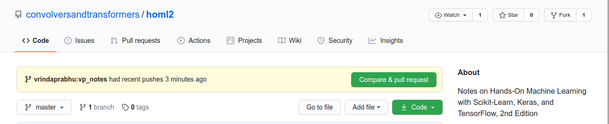
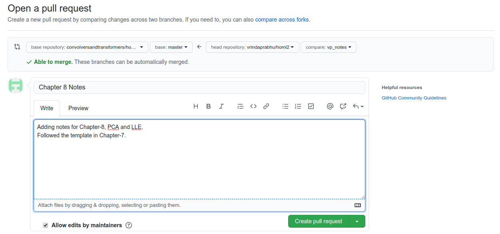

# Contributing

Here's a short tutorial listing out the simplest method to contribute notes _(code snippets, scripts, gists, etc.)_ to **homl2** repository. The following are the main steps involved in raising a PR. There is **TLDR** section for busy folks at the end of the doc. Feel free to skip the details to have a quick look there, but make note of **step 3**.

### 1. Fork the repository
**Fork** the main repository to your personal **GitHub** account, like in the image shown below. Click on the **Fork** button at the top right corner *(highlighted in blue)* of the repository.



The repo will be now available in your namespace.



### 2. Clone the repository locally
Now, git clone the repository locally for development.

```bash
git clone https://github.com/vrindaprabhu/homl2.git
```

Replace the account name with yours.

### 3. Create a new branch
Now, go into the cloned folder and create a branch for development. It is **best practice** to create a new branch to start your development work, so that you can sync your local master branch with remote without affecting your development work or running into unnecessary merge issues.

```bash
git checkout -b [your_name]_chapter_[chapter_num]
# Example:
git checkout -b vp_chapter_8
```

**IMPORTANT:** Of course, you can use the branch name that you like. But for every chapter (single or related bunch of files) **_create_** a new branch. Each pull request depends on the branch. A pull request with commits across multiple files will cause a lot of merge issues and will affect other curated chapters contributed by others, unless you are the first to contribute them.

### 4. Set your upstream repo

Configure an upstream repository as your remote allowing you to sync changes you make to your fork with the original repository. 

```bash
git remote add upstream https://github.com/convolversandtransformers/homl2
```

### 5. Create your file, stage and commit
```bash
# Write something to the file, hopefully notes :)
vim "Chapter 8. Dimensionality Reduction.md"
# Stage the file using the `add` command
git add "Chapter 8. Dimensionality Reduction.md"
# Commit the file with simple message
git commit -m "Adding notes for Chapter 8"
```

### 6. Push it to remote
Finally, push to remote. Check your GitHub account to see it reflected.

```bash
git push -u origin vp_chapter_8
```

This will push your changes to your remote GitHub as well all the upstream accounts. While pushing, you'll get prompted to enter your credentials. 

Push status is displayed as follows:



### 7. Compare and create a pull request
In your forked repo, there will be 2 branches now, i.e. **master** and your new dev branch. You'll see the new file reflected in the new branch.




If  you check the main repository, you'll see there's a notification for a pull request. 




Use the GUI to happily compare and create a pull request!  




After doing that, you can follow up on the status of your pull requests by clicking on it and asking for a review.

**And we're done!**


## TL;DR
In summary, if you want to contribute, the simplest way is to:

1.  Fork the main project
2.  Clone it to your local system
3.  Make a new branch
4.  Link the upstream to the original project which was cloned
5.  Make your changes, stage the files and commit your changes
7.  Push it to remote
8.  Compare and create a pull request

Repeat steps 5 and 7 to add more commits to your pull request.

**Important:** 

 - Every new PR made == New branch (refer to step 3).
 - You can also click **Create pull request** to open a new pull request in the Web GUI.


## References
- [Creating a Pull Request: GitHub docs](https://docs.github.com/en/github/collaborating-with-issues-and-pull-requests/creating-a-pull-request)

