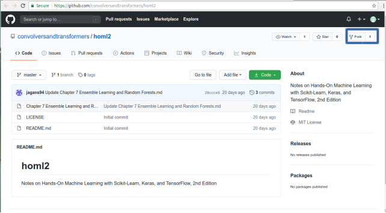
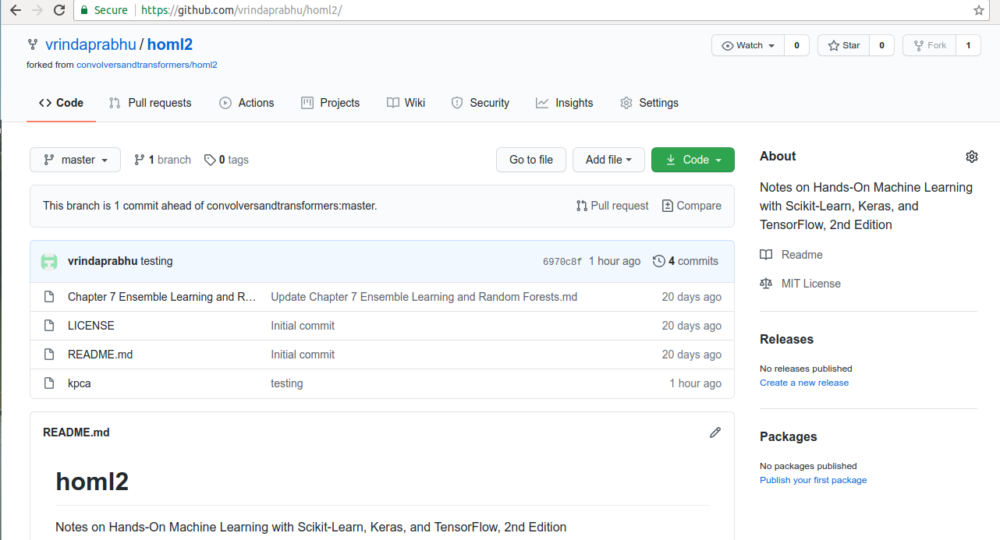
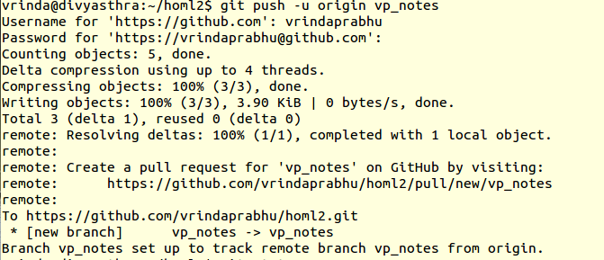
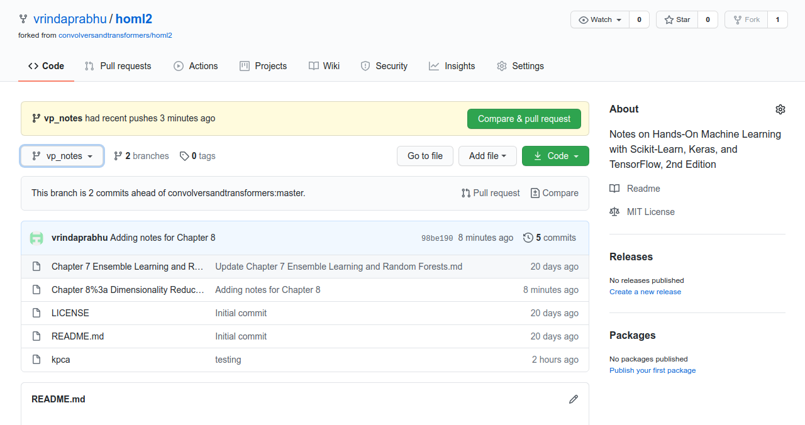
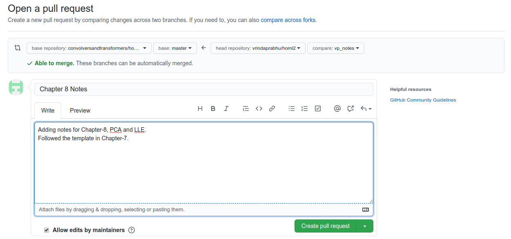

# Creating a PR - Short Guide

This document lists out the steps required to contribute notes and/or even some examples _(code snippets, scripts, gists etc,. )_ to **homl2** repository.

## Main Steps
The following are the main steps involved in raising a PR. There is TL;DR section for busy folks at the end of the doc. Feel free to skip the details to have a quick look there!

### Step-1 
**Fork** the main repository to your personal Github account.

The repo will be now available in your namespace.

### Step-2
Now, git clone the repository locally for development.
***Example***:  `git clone https://github.com/vrindaprabhu/homl2.git`

### Step-3
Now, go into the cloned folder and create a branch for development. _Perhaps, this is just a best practise method so that your local master and the main master are same._
***Example:***  `git checkout -b vp_notes`

### Step-4
Create a new remote for the upstream repo. This can be done with the below command.
***Example:***  `git remote add upstream https://github.com/convolversandtransformers/homl2`
The *"upstream repo"* refers to the original repo that was initially forked.

### Step-5
Add the files/folders.
***Example:***  `git add Chapter8_Dimensionality_Reduction.md`

### Step-6
Commit with a good message.
***Example:***  `git commit -m "Adding notes for Chapter 8"`

### Step-7
Finally, push to reflect it remotely.
***Example:***  `git push -u origin vp_notes`

Since, I am using a *https* login, I get prompted to enter my credentials. Also, push status is also displayed.

### Step-8
In the forked repo, there will be 2 branches now. Also, in the created branch, the new file will be reflected.

This will also be notified in the main repo.

Use the GUI to happily compare and create a pull request!

**And we are done!**

## TL;DR
In summary, if you want to contribute, the simplest way is to:

1.  Fork the main project
2.  Clone it to your local system
3.  Make a new branch
4.  Link the upstream to the original project which was cloned
5.  Make your changes _(add/update files/folders)_
6.  Commit the changes
7.  Push it back to your repo
8.  Click the ****Compare & pull request**** button

Repeat steps 5 and 7 to add more commits to your pull request.

**_NOTE:_** 

 - Every New PR == New Branch
 - You can also click ****Create pull request**** to open a new pull request

## Reference Link
[Creating a Pull Request: GitHub docs](https://docs.github.com/en/github/collaborating-with-issues-and-pull-requests/creating-a-pull-request)

