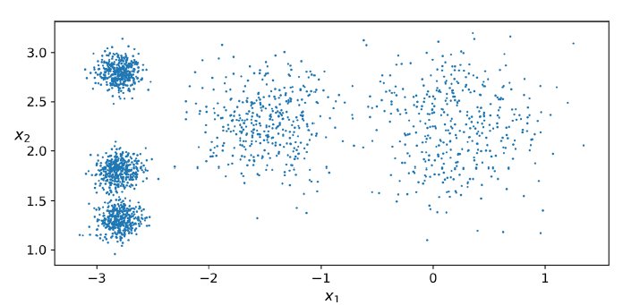
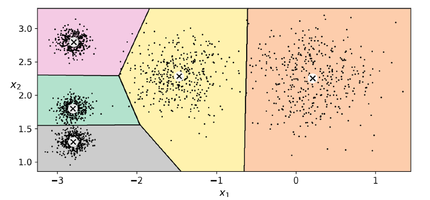
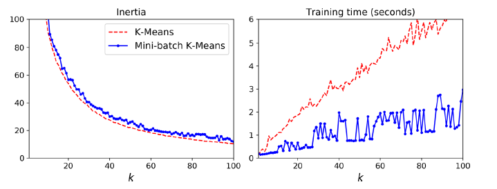
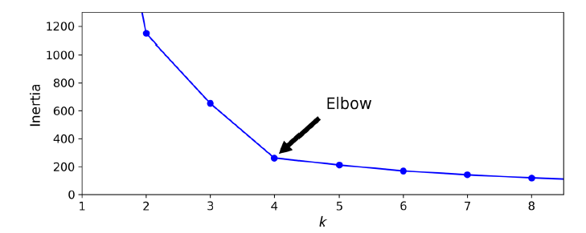
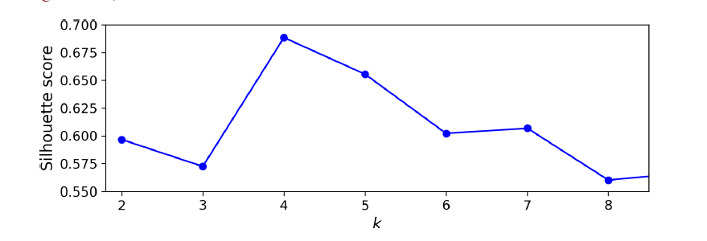
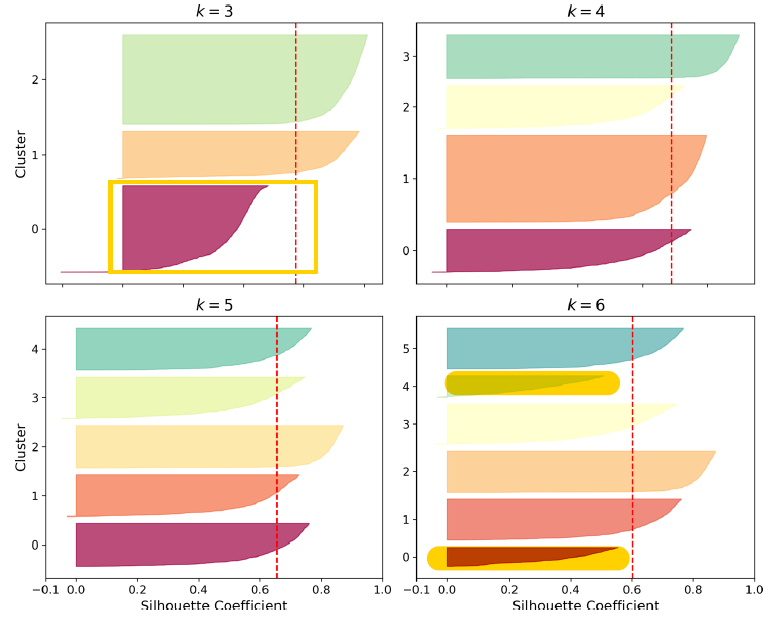

# Chapter 9. Unsupervised Learning Techniques - Part I

**Keywords**: _k-means_, _dbscan_, _gmms_

> If intelligence was a cake, unsupervised learning would be the cake (bread), supervised learning would be the icing on the cake, and reinforcement learning would be the cherry on the cake. 	- Yan LeCunn

Most data available to us is un-labelled. One way to exploit this huge corpus of un-labelled data is through unsupervised learning. There's a lot of untapped potential with un-labelled datasets that we've barely tapped into. 

Take for example, any **classification** problem. If you want to classify pictures of something you'd need to sit and tediously label all the images for training, depending on the use-case, this could be anywhere from thousands to millions of labelled images. 

Wouldn't it be great to somehow reduce or even eliminate the time it requires to label or even train such dataset. Enter the **cake**, a.k.a unsupervised learning.

**Unsupervised Techniques: ** _Clustering, Anomaly Detection and Density Estimation._

Each of the techniques above can be used for data analysis, customer segmentation, recommender system, image segmentation, semi-supervised learning, anomaly detection and more. 

## Clustering

**Definition**: Identifying and assigning instances to clusters or groups containing similar instances.

Clustering has many use-cases. Here's some of them discussed briefly:

- **Customer Segmentation.** This refers to clustering your users based on their web activity (preferences and other attributes) and into _segments_. You can then adapt your products or marketing campaigns to each such segment, allowing you to recommend products/content that might be useful to people in each segment.
- **Data Analysis.** Quickly running clustering on a (labelled) dataset to figure out whether there's an intrinsic pattern in each cluster.
- **Dimensionality Reduction.** You represent each instance by the vector of it's affinity values to each cluster. This means, for $k$ clusters, you get a $k$ dimensional vector representing the instance, which is usually much smaller than original vector.
- **Anomaly Detection.** Any instance with low affinity with any (major) clusters can be considered an anomaly.
- **Active Learning.** Propagating labels from a few learned/annotated labels to the rest of the instances in the same cluster. Very useful for labelling jobs and creating datasets for supervised algorithm.
- **Search Engine.** Given a sample, identify it's cluster and return similar samples from the same cluster. Very useful for indexing and search platforms for varying content types.
- **Image Segmentation.** Clustering pixels in an image and replacing the pixel values with the mean pixel value of a cluster. Very useful for tracking contour of objects.

### K-Means

The simplest clustering algorithm. For example, take the following un-labelled dataset.

The K-Means algorithm is pretty straightforward. 

1. You choose the no. of clusters or blobs you want. In this case, we'll choose 5 (pretty obvious from the data). 
2. K-Means will then try to iteratively find the blob's center in the dataset and assign each instance to the blob, based on it's proximity until it converges to the best solution.

If you trained a K-Means cluster on this dataset you'll get an output similar to this.

**Note:** 

1. In this case the no. of clusters is chosen was a good fit for the data. This is **not** always the case.
2. Doesn't behave very well with clusters of **varying size** _(check the boundary, some instances along the boundary are assigned to other clusters)_, since the algorithm only looks at L2 norm for clustering.

Instead of performing _hard-clustering_, i.e. assigning instances to cluster with closest centre, we can represent each instance by the vectors of it's distance/similarity score to each cluster, which is called _soft-clustering_.

Using _soft-clustering_, we can represent a $n$-d instance as a $k$-d (# of clusters) vector. **This can be a very effective non-linear dimensionality reduction technique.**

#### K-Means Algorithm

As already mentioned the algorithm is actually straightforward. So here, we'll just be covering the specs of the algorithm and other techniques.

**Steps:**

1. Randomly initialize $k$ centroids.
2. Calculate distance of each instance from the centroids.
3. Update the label of each instance based on proximity or centroid score.
4. Update the centroids based on the labelled instances.
5. Repeat 2-4 till convergence.

**Computational complexity**: $O(n,m,k)$; 

- m - # of instances
- n - # of features/attributes
- k - # of clusters

The algorithm is guaranteed to converge, but might converge into a local optima, subject to centroid initialization done.

**Centroid Initialization Strategies:** To avoid bad local optima, you can do one of two things.

1. Use previous best results from different clustering runs to initialize the centroids.
2. Run K-Means multiple times till you hit the right solution.

The `sklearn` library already does this by running the algorithm `n_init` times, which defaults to 10.

#### K-Means Improvements

There's been a bunch of improvements to the K-means algorithm (founded in 1967) all the way to 2016. We'll be discussing a bunch of these next. All of these improvements have actually been baked into the `sklearn` library, so there's no special implementation required.

##### Centroid Initialization: [K-Means++](http://ilpubs.stanford.edu:8090/778/1/2006-13.pdf)

The K-Means++ paper suggests the following algorithm

1. Choose a centroid $c^{(1)}$ uniformly at random from the dataset.
2. Choose a new centroid $c^{(i)}$ with the following probability: $\frac{D(x)^2}{\sum_{x {\epsilon} X}{D(x)}^2}$, where $D(x)$ is the distance between the instance $x$ and the closest chosen center $c$.  
3. Repeat 2 till $k$ centroids are chosen.

**Put simply**, this formula means, farther points will have *higher probability* of being chosen than closer points. This way we don't randomly choose centers which are very close together and end up splitting a single cluster into two.

##### Accelerated K-Means and mini-batch K-Means

[Accelerated K-Means](https://www.aaai.org/Papers/ICML/2003/ICML03-022.pdf): Charles Elkan (2003)

[Mini-batch K-Means](https://dl.acm.org/doi/abs/10.1145/1772690.1772862): David Sculley (2010)

For the mini-batch version of K-Means you'll have to switch from `from sklearn.clusters import KMeans` to `from sklearn.clusters import MiniBatchKMeans`.

For the mini-batch version, the `inertia` is slightly worse, however, the speedup more than enough makes up for it.

#### Finding Optimal # of Clusters

As we saw earlier, the sample data used was easy to dissect into 5 clusters. However, in reality, that would be far from it. So the question is, what's a good way to choose the no. of clusters?

There may be more, but in here we'll discuss two major ways:

1. Using `inertia`: Not recommended. **TL;DR** - Jump to silhouette
2. Using `silhouette_score`: Recommended.

##### Inertia:

Usually the K-Means algorithm, uses the `inertia` value for deciding which initialized model (using `n_init`) to return as the best performer. 
$$
inertia = \sum^{n}_{i=0}{min_{ \mu_j {\epsilon} C}(||x_i - {\mu}_j||^2)}
$$
This translates to sum of square of distances of each instance from the closest cluster centre.

This value is usually used as a metric for evaluating different hyper-parameters for K-Means (# of clusters being one of them). 

Inertia decreases with increase in $k$. So, it's usually a **poor** metric for finding the exact no. of clusters. However, there's a coarse way to use inertia to solve this, by choosing the value of $k$ corresponding to greatest change in inertia. In the below example, this corresponds to **4.** 

But, in general it's a poor metric. When in doubt switch to **silhouette**.

##### [Silhouette Score](https://scikit-learn.org/stable/modules/clustering.html#silhouette-coefficient):

The **Silhouette Coefficient** is defined for each sample and is composed of two scores:

- **a**: The mean distance between a sample and all other points in the same class.
- **b**: The mean distance between a sample and all other points in the *next nearest cluster*.

The Silhouette Coefficient *s* for a single sample is then given as:

$$
s_i = \frac{b-a}{max(b,a)}
$$

The Silhouette Score for a set of samples is given as the mean of the Silhouette Coefficient for each sample. 

It's defined as the mean **silhouette co-efficient** over all instances.
$$
S = \frac{1}{M}\sum_{i=0}^{M}s_i
$$
A silhouette score of ranges from -1 to +1. A silhouette score near;

- **-1** signifies, possible wrong assignment. 
- **0** signifies overlapping clusters. 
- **+1** signifies correct assignment.

When used as metric for clustering, it gives a clear picture that **4** is the ideal choice, with **5** close behind and other $k$ values being even poorer.

Let's go one step ahead, by plotting the *silhouette diagram*.

The _silhouette diagram_ consists of **knife-shaped** representation per cluster. The width (shorter side) of the knife blade corresponds to the # of samples in that cluster and the length (longer side) indicates the silhouette score per sample arranged in descending order (hence the _knife_ shape). The red dotted line indicates the combined silhouette score of all clusters.

With this let's come to **interpretation**. If the silhouette co-efficient of any cluster is lower than the threshold (dotted line), then that means that the cluster is spread out and has higher overlap with other clusters. Obviously this is not preferred.

In general, the **rule of thumb** when choosing the value $k$ using _silhouette diagram_ is to look for the one in which most of the knife blades have **length** $>=$ **threshold**, with more evenly distributed knife representations being preferred over fat ones.

This means 3 and 6 are obviously poor choices, with 4 and 5 looking better. Among the latter, even though 4 has a higher co-efficient, 5 is the better choice, since the samples in 5 seem to more evenly distributed which satisfies the above **ROT**.

### Limits of K-Means

K-Means is good, fast and scalable. However, it has a lot of deficiencies, namely:

1. You need to specify $k$ to start clustering.
2. Requires multiple, **careful** initializations. 
3. Doesn't behave very well with clusters of varying sizes, densities and non-spherical shape.

**Note:** Always scale your features before using K-Means.

### Clustering Uses

1. **Image Segmentation**
   - SOTA image/instance segmentation is performed using complex CNN models. 
   - However, K-Means can be used for something simple like color segmentation.
   - **Note**: Pretty neat idea. However, I don't see much use in it, unless if used as a starter step to identify samples for instance/image segmentation to train SOTA models.

2. **Pre-processing**
   - Use clustering for pre-processing step, especially before a classification problem.
3. **Semi-supervised Learning**
   - When you have a noisy dataset, you can use clustering to assign labels to instances belonging to each cluster by propagating label of the cluster centre to all/partial set of instances belonging to the cluster.
   - This allows you to label a large dataset effectively and evaluate on a small labelled test set.
   - If the model performs well, this means that the propagated labels were effective. If not, clustering needs to be addressed and improved. 
4. **Active Learning**
   - There are many different active learning techniques. Popular among them is **un-certainty** sampling.
   - Use a human operator to moderate samples predicted with low certainty and re-train the model on moderated samples. Repeat this process on new un-labelled data until the performance improvement is not worth the labelling process.

### DBSCAN

